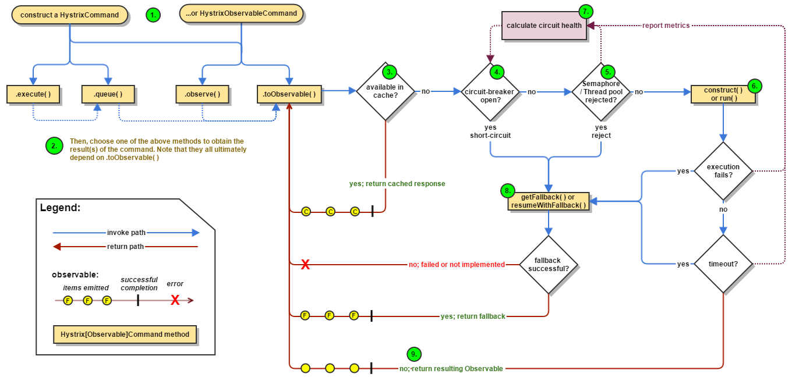

# springcloud-hystrix

## 增加容错保护

#### 1. 引入pom
		<dependency>
			<groupId>org.springframework.cloud</groupId>
			<artifactId>spring-cloud-starter-hystrix</artifactId>
		</dependency>
		
#### 2. 开启断路器
> @EnableCircuitBreaker

#### 3. 增加 @HystrixCommand 指定异常回调方法

#### 4. 添加Dashboard
要运行Hystrix仪表板使用@EnableHystrixDashboard注释您的Spring Boot主类。
然后访问/hystrix，并将仪表板指向Hystrix客户端应用程序中的单个实例/hystrix.stream端点。
## 熔断、降级
## 依赖隔离
## 请求缓存
## 请求合并